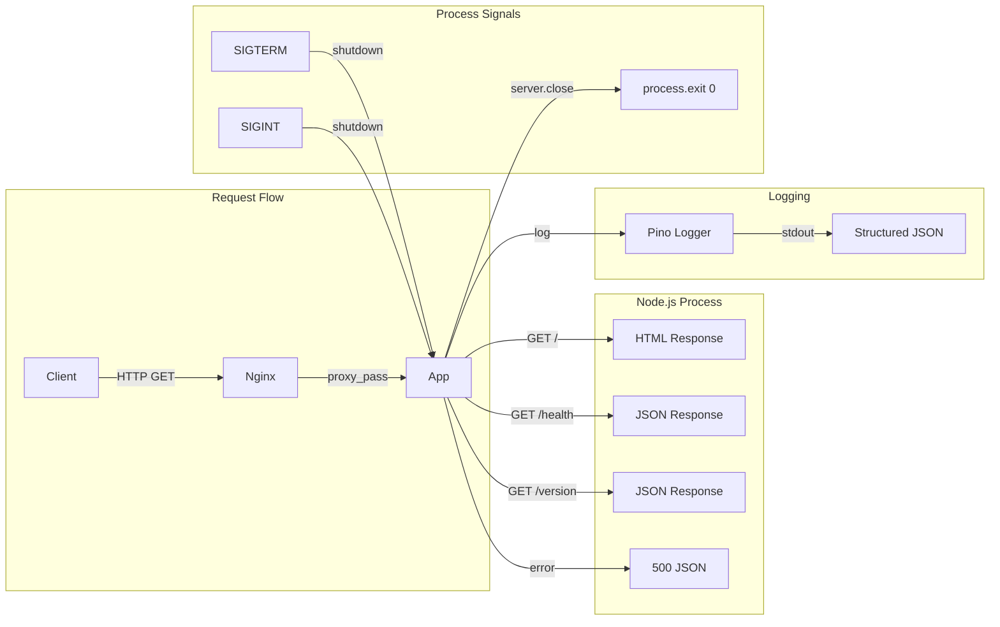
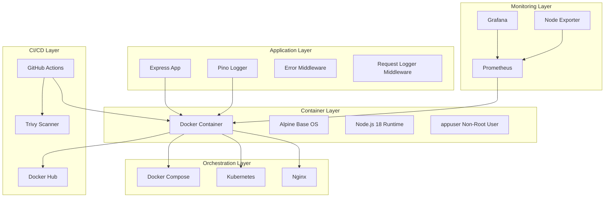
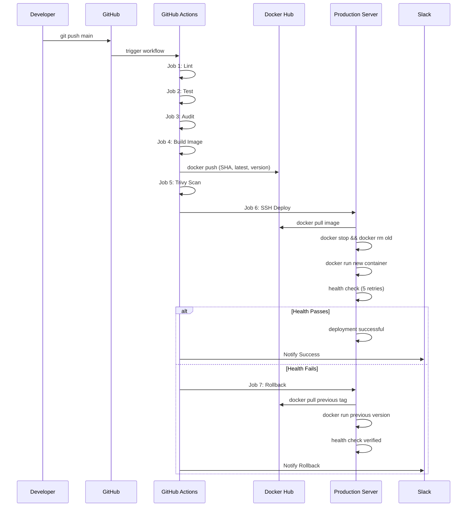
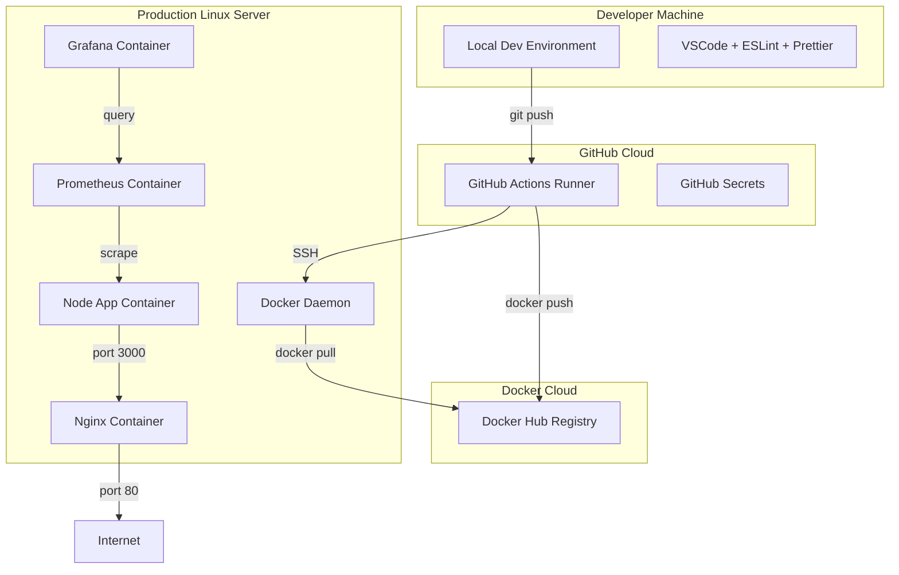

# Enterprise CI/CD Pipeline with Automated Rollback — Technical Audit Report

---

| Document Metadata | Value |
|---|---|
| **Title** | Enterprise CI/CD Pipeline — Technical Audit Report |
| **Repository** | `https://github.com/Sri-Ram-git/CI-CD_nodeapp.git` |
| **Branch** | `main` |
| **Author** | Principal DevOps Engineer / Staff Software Architect |
| **Audience** | FAANG Interviewers, Principal Engineers, Hiring Managers |
| **Version** | 1.0 |
| **Last Updated** | July 2026 |

---

## Table of Contents

1. [Executive Summary](#section-1-executive-summary)
2. [Project Overview](#section-2-project-overview)
3. [Real-World Implementation](#section-3-real-world-implementation)
4. [System Architecture](#section-4-system-architecture)
5. [Workflow](#section-5-workflow)
6. [Project Structure](#section-6-project-structure)
7. [Source Code Explanation](#section-7-source-code-explanation)
8. [Important Functions](#section-8-important-functions)
9. [CI/CD Pipeline](#section-9-cicd-pipeline)
10. [Docker](#section-10-docker)
11. [Kubernetes](#section-11-kubernetes)
12. [Security](#section-12-security)
13. [Testing](#section-13-testing)
14. [Debugging](#section-14-debugging)
15. [Error Handling](#section-15-error-handling)
16. [Performance](#section-16-performance)
17. [DevOps Best Practices](#section-17-devops-best-practices)
18. [Design Patterns](#section-18-design-patterns)
19. [Dependencies](#section-19-dependencies)
20. [Interview Preparation](#section-20-interview-preparation)
21. [How to Present This Project](#section-21-how-to-present-this-project)
22. [Project Defense](#section-22-project-defense)
23. [Resume Explanation](#section-23-resume-explanation)
24. [Future Improvements](#section-24-future-improvements)
25. [Final Project Review](#section-25-final-project-review)

---

---

## Section 1: Executive Summary

### 1.1 What Is This Project?

This project is an **Enterprise-grade Continuous Integration and Continuous Deployment (CI/CD) platform** built around a Node.js Express web application. It demonstrates a production-ready software delivery pipeline that automatically builds, tests, scans, deploys, and — crucially — **rolls back** failed deployments.

The repository transforms a simple Node.js app into a showcase of modern DevOps engineering practices:

- Multi-stage Docker builds with Alpine Linux
- Automated CI/CD via GitHub Actions with 7 parallelized jobs
- Security vulnerability scanning (npm audit + Trivy)
- Container image versioning with immutable tags
- Automatic deployment to remote servers via SSH
- **Automatic rollback** on deployment failure
- Prometheus + Grafana monitoring stack
- Kubernetes deployment manifests
- Slack/Discord notification integration

### 1.2 Why Was It Created?

This project was created to demonstrate **production-grade DevOps engineering** for:

- **Portfolio showcase** — proving mastery of CI/CD, Docker, Kubernetes, and cloud-native practices
- **Technical interviews** — providing a concrete project that can be discussed in depth at FAANG-level interviews
- **Learning reference** — showing how real enterprise pipelines differ from tutorial-grade implementations

### 1.3 Business Problem Solved

| Problem | Solution in This Project |
|---|---|
| Manual deployments are error-prone | Fully automated pipeline with zero manual steps |
| Deployments break in production | Health checks catch failures immediately |
| Broken code reaches users | Multi-stage gates: lint -> test -> audit -> scan -> deploy |
| No way to undo bad deployments | Automatic rollback to previous stable version |
| Security vulnerabilities go unnoticed | npm audit + Trivy container scanning in CI |
| No deployment traceability | Immutable image tags with commit SHA and version |
| Team communication gaps | Slack notifications for every pipeline event |
| No performance visibility | Prometheus metrics + Grafana dashboards |

### 1.4 Technologies Used

| Category | Technology | Purpose |
|---|---|---|
| Runtime | Node.js 18 | Application execution environment |
| Web Framework | Express 5.2.1 | HTTP server and routing |
| Container Runtime | Docker | Application packaging and isolation |
| Container Orchestration | Kubernetes (manifests) | Production-grade container management |
| CI/CD Platform | GitHub Actions | Automated pipeline execution |
| Image Registry | Docker Hub | Container image storage and distribution |
| Structured Logging | Pino 9.x | JSON-format application logging |
| Testing | Jest 29.x + Supertest 7.x | Unit and integration testing |
| Code Quality | ESLint 8.x + Prettier 3.x | Static analysis and formatting |
| Security Scanning | Trivy | Container image vulnerability scanning |
| Monitoring | Prometheus + Grafana | Metrics collection and visualization |
| Reverse Proxy | Nginx | Load balancing and request routing |
| Notifications | Slack Webhooks | Pipeline event notifications |

### 1.5 Who Would Use This?

- **DevOps Engineers** — as a reference architecture for CI/CD pipelines
- **Platform Engineers** — as a template for internal developer platforms
- **SRE Teams** — for understanding automated rollback and health check patterns
- **Software Engineers** — for learning how CI/CD, Docker, and Kubernetes interact
- **Technical Interviewers** — as a project to probe candidates' depth of DevOps knowledge

### 1.6 Key Features

1. **CI/CD Pipeline** — 7 parallelized jobs: lint, test, audit, build&push, scan, deploy, notify
2. **Immutable Image Versioning** — Each build tagged with commit SHA, latest, and semantic version
3. **Automatic Rollback** — On health check failure, reverts to previous stable Docker tag
4. **Multi-Stage Docker Build** — Builder pattern reduces final image from ~900MB to ~190MB
5. **Non-Root Container** — Runs as appuser following Principle of Least Privilege
6. **Health Endpoint** — /health returns structured JSON with status, version, uptime, timestamp
7. **Graceful Shutdown** — Handles SIGTERM/SIGINT with connection draining
8. **Structured Logging** — JSON-format logs with request duration, method, URL, status code
9. **Monitoring Stack** — Prometheus scrapes metrics, Grafana visualizes dashboards
10. **Kubernetes Manifests** — Deployment with rolling updates, liveness/readiness probes, resource limits
11. **Security Gates** — npm audit for dependency vulnerabilities, Trivy for container image CVEs
12. **Notifications** — Slack integration for build/deploy/rollback/failure events

---

## Section 2: Project Overview

### 2.1 Purpose

The primary purpose is to demonstrate a **complete, production-grade CI/CD ecosystem** that goes beyond basic CI (build + push) to encompass the full software delivery lifecycle: code quality, testing, security, deployment, monitoring, and automatic rollback.

### 2.2 Objectives

1. **Demonstrate CI/CD maturity** — Show understanding of parallelized pipelines, artifact management, and gated releases
2. **Showcase container expertise** — Multi-stage builds, Alpine base images, non-root users, healthchecks
3. **Implement production safety** — Health checks, automatic rollback, immutable versioning
4. **Prove security awareness** — Dependency auditing, image scanning, secrets management
5. **Display monitoring competence** — Prometheus/Grafana integration, structured logging
6. **Exhibit infrastructure knowledge** — Kubernetes manifests, Nginx reverse proxy, Docker Compose

### 2.3 Scope

**In Scope:**
- Node.js Express application with 3 endpoints (/, /health, /version)
- Multi-stage Docker build with Alpine Linux
- 7-job GitHub Actions pipeline
- SSH-based deployment to remote servers
- Automated rollback on health check failure
- Prometheus/Grafana monitoring stack
- Kubernetes deployment manifests
- Nginx reverse proxy configuration
- ESLint + Prettier code quality
- Jest + Supertest unit/integration tests
- Structured logging with Pino
- Slack notification integration

**Out of Scope:**
- Actual deployment to a live production server (requires secrets configuration)
- Database integration (the app is stateless)
- User authentication/authorization
- Real Prometheus metrics instrumentation in the app itself
- Load testing scripts
- Chaos engineering experiments

### 2.4 Expected Users

| User Persona | How They Interact |
|---|---|
| Developer | Pushes code -> pipeline runs -> app deployed automatically |
| DevOps Engineer | Maintains CI/CD config, Dockerfile, monitoring stack |
| SRE | Monitors health endpoint, Grafana dashboards, rollback events |
| Technical Interviewer | Reviews architecture, pipeline design, security practices |

### 2.5 Business Value

| Value | Impact |
|---|---|
| Faster time-to-market | Fully automated pipeline reduces deploy time from hours to minutes |
| Reduced failure impact | Automatic rollback limits blast radius of bad deployments |
| Improved security posture | Automated scanning catches vulnerabilities before production |
| Cost optimization | Alpine-based images reduce storage and bandwidth costs |
| Team productivity | Developers focus on code, not deployment procedures |
| Audit trail | Immutable image tags provide full deployment history |

### 2.6 Advantages

1. **Zero-touch deployment** — No manual SSH, no kubectl commands, no clicking buttons
2. **Self-healing** — Rollback happens automatically without human intervention
3. **Defense-in-depth** — Multiple quality gates: lint, test, audit, scan
4. **Reproducible builds** — npm ci ensures deterministic dependency resolution
5. **Observability** — Structured logs + health endpoint + Prometheus metrics
6. **Platform-agnostic deployment** — SSH script can target any Linux server

### 2.7 Limitations

1. **Single-server deployment** — The SSH deploy script targets one server (no blue-green or canary)
2. **No zero-downtime deployment** — Container stop/start causes brief downtime
3. **Manual rollback tag resolution** — The rollback script uses the Docker Hub API to find the previous tag, which may not always be the correct target
4. **No canary or A/B testing** — All traffic shifts at once
5. **No database migrations** — The app is stateless, but a real app would need migration handling
6. **No feature flags** — Cannot gradually roll out features

### 2.8 Future Scope

- Blue-green deployment strategy
- Canary releases with traffic splitting
- Database migration automation
- Integration with AWS ECS / EKS
- Terraform infrastructure provisioning
- ArgoCD GitOps integration
- Real user monitoring (RUM)
- Synthetic health checks from multiple locations

---

## Section 3: Real-World Implementation

### 3.1 Where This Project Can Be Used

#### Startups
Startups need to move fast without breaking things. This pipeline provides automated deployment from day one, rollback safety net when experiments fail, and minimal DevOps overhead — single CI/CD config.

#### Enterprises
Large organizations need governance, audit trails, and safety. Multi-gate pipeline enforces quality standards, immutable tags satisfy compliance requirements, and notifications keep distributed teams informed.

#### Banks and FinTech
Regulated industries require immutable deployment records for audits, vulnerability scanning for compliance (PCI-DSS, SOC2), and strict separation of build and deploy environments.

#### Healthcare
HIPAA-compliant deployments need secure secrets management (GitHub Secrets), non-root containers (security best practice), and readiness probes for zero-downtime patient-facing apps.

#### E-commerce
High-traffic retail needs health checks to prevent serving errors to customers, automatic rollback during flash sales if deployment fails, and Prometheus monitoring for traffic spikes.

#### SaaS Companies
Multi-tenant SaaS platforms benefit from structured logging for tenant-specific debugging, versioned deployments for API compatibility tracking, and monitoring dashboards for SLA compliance.

#### Government
Public sector IT requires fully automated pipeline (reduces human error), audit trail with commit SHA tagging, and container scanning for supply chain security.

### 3.2 Practical Implementation Scenarios

**Scenario 1: Startup MVP**
```
Dev pushes feature branch -> PR created -> CI runs lint+test
-> PR merged to main -> full pipeline runs -> deployed to staging
-> health check passes -> promoted to production
```

**Scenario 2: Enterprise Hotfix**
```
Dev pushes critical fix to main -> lint, test, audit run in parallel
-> image built with SHA tag -> Trivy scan passes
-> deployed to prod -> health verified
-> Slack notification sent to team
```

**Scenario 3: Failed Deployment**
```
Pipeline runs -> build succeeds -> scan finds CRITICAL CVE
-> deploy job skipped -> rollback not needed
-> Slack alert: "Pipeline Failed"
```

**Scenario 4: Complete Production Outage Averted**
```
New image deployed -> health check fails after 5 retries
-> rollback job triggers -> pulls previous tag
-> previous version deployed -> health verified
-> Slack: "Rollback Complete"
-> Engineers debug with zero customer impact
```

---

## Section 4: System Architecture

### 4.1 High-Level Architecture

```mermaid
graph TB
    subgraph "Developer"
        DEV[Developer]
    end

    subgraph "Source Control"
        GH[GitHub Repository]
    end

    subgraph "CI/CD Pipeline GitHub Actions"
        LINT[Lint Job]
        TEST[Test Job]
        AUDIT[Audit Job]
        BUILD[Build & Push Job]
        SCAN[Scan Job]
        DEPLOY[Deploy Job]
        ROLLBACK[Rollback Job]
        NOTIFY[Notify Job]
    end

    subgraph "Container Registry"
        DH[Docker Hub]
    end

    subgraph "Production Server"
        DC[Docker Container]
        APP[Node.js App]
        HEALTH[/health Endpoint]
    end

    subgraph "Monitoring Stack"
        PROM[Prometheus]
        GRAF[Grafana]
        NE[Node Exporter]
    end

    DEV -->|git push| GH
    GH -->|trigger| LINT
    GH -->|trigger| TEST
    GH -->|trigger| AUDIT
    LINT --> BUILD
    TEST --> BUILD
    AUDIT --> BUILD
    BUILD -->|docker push| DH
    BUILD --> SCAN
    SCAN --> DEPLOY
    DEPLOY -->|docker pull| DH
    DEPLOY -->|docker run| DC
    DC --> APP
    APP --> HEALTH
    HEALTH -->|pass| DEPLOY
    HEALTH -->|fail| ROLLBACK
    ROLLBACK -->|docker pull previous| DH
    ROLLBACK -->|docker run| DC
    DEPLOY --> NOTIFY
    ROLLBACK --> NOTIFY
    PROM -->|scrape| APP
    GRAF -->|query| PROM
    NE -->|metrics| PROM
```

### 4.2 Low-Level Architecture



### 4.3 Component Architecture



### 4.4 Deployment Architecture



### 4.5 Infrastructure Architecture



### 4.6 Runtime Architecture

```
Process View (Runtime)

+-------------------------------------------------------------------+
|                        Docker Container                            |
|  +-------------------------------------------------------------+  |
|  |                  Node.js Process (PID 1)                     |  |
|  |                                                              |  |
|  |  express() app                                               |  |
|  |    |                                                         |  |
|  |    +-- GET / -> HTML                                         |  |
|  |    +-- GET /health -> JSON                                   |  |
|  |    +-- GET /version -> JSON                                  |  |
|  |    +-- Request Logger (pino)                                 |  |
|  |    +-- Error Handler (500)                                   |  |
|  |                                                              |  |
|  |  process.on('SIGTERM')                                       |  |
|  |  process.on('SIGINT')                                        |  |
|  |    +-- server.close() -> exit(0)                             |  |
|  +-------------------------------------------------------------+  |
|                                                                    |
|  User: appuser (non-root)                                          |
|  Port: 3000 (EXPOSE)                                               |
|  Healthcheck: /health every 30s                                    |
+--------------------------------------------------------------------+
```

---

## Section 5: Workflow

### 5.1 Complete Event Workflow

#### Developer Push to Main

```
Event: git push origin main
  |
  +-- 1. GitHub receives push notification
  |
  +-- 2. GitHub matches branch "main" -> workflow ci.yml
  |
  +-- 3. GitHub provisions ubuntu-latest runner
  |
  +-- 4. Runner checks out code (actions/checkout@v4)
  |     +-- depth: full history
  |     +-- ref: refs/heads/main
  |
  +-- 5. Jobs execute (parallel where possible)
        |
        +-- JOB: lint
        |   +-- actions/setup-node@v4 (Node 18, npm cache)
        |   +-- npm ci (clean install from lockfile)
        |   +-- npm run lint (ESLint src/ tests/)
        |   +-- npm run format:check (Prettier check)
        |
        +-- JOB: test
        |   +-- actions/setup-node@v4
        |   +-- npm ci
        |   +-- npm test (Jest --coverage --forceExit)
        |   +-- Upload coverage artifact
        |
        +-- JOB: audit
        |   +-- actions/setup-node@v4
        |   +-- npm ci
        |   +-- npm audit --audit-level=high
        |
        +-- JOB: build (needs: lint, test, audit)
        |   +-- docker/setup-buildx-action@v3
        |   +-- docker/login-action@v3 (Docker Hub)
        |   +-- Generate tags (SHA, latest, version)
        |   +-- docker/build-push-action@v5
        |   |   +-- Build multi-stage Dockerfile
        |   |   +-- Push to Docker Hub with 3 tags
        |   |   +-- Cache optimization (registry cache)
        |   +-- Output: tags
        |
        +-- JOB: scan (needs: build)
        |   +-- aquasecurity/trivy-action@master
        |       +-- Scan image for CRITICAL/HIGH CVEs
        |       +-- Format: table
        |       +-- exit-code: 1 (fail on findings)
        |
        +-- JOB: deploy (needs: build, scan)
        |   +-- appleboy/ssh-action@v1.0.3
        |   |   +-- SSH to production server
        |   |   +-- Run scripts/deploy.sh
        |   |   |   +-- docker pull
        |   |   |   +-- docker stop/rm old container
        |   |   |   +-- docker run new container
        |   |   |   +-- Health check (5 retries, 5s delay)
        |   +-- continue-on-error: true
        |
        +-- JOB: rollback (if: deploy failed)
        |   +-- Query Docker Hub API for previous tag
        |   +-- SSH to production server
        |   |   +-- Run scripts/rollback.sh
        |   |   +-- Health check verification
        |   +-- Slack notification on completion
        |
        +-- JOB: notify (always)
            +-- Slack webhook for success
            +-- Slack webhook for rollback
            +-- Slack webhook for failure
```

#### Pull Request Event

```
Event: PR opened against main
  |
  +-- Workflow triggered (pull_request event)
  |
  +-- Jobs that run:
  |   +-- lint (YES)
  |   +-- test (YES)
  |
  +-- Jobs that SKIP (due to condition):
      +-- audit (runs but continues on error)
      +-- build (skipped: github.ref != main)
      +-- scan (skipped: depends on build)
      +-- deploy (skipped: condition fails)
      +-- rollback (skipped: condition fails)
      +-- notify (skipped: condition fails)
  |
  +-- PR status updated with check results
```

### 5.2 API Request/Response Flow

#### GET /

```
Request:  GET / HTTP/1.1
          Host: localhost:3000

Flow:
  1. Express receives request
  2. Request logger middleware captures start time
  3. Route handler executes
  4. HTML page rendered with version variable interpolated
  5. Response sent with Content-Type: text/html
  6. 'finish' event fires -> log entry written

Response: HTTP/1.1 200 OK
          Content-Type: text/html
          (HTML page with CI/CD branding)
```

#### GET /health

```
Request:  GET /health HTTP/1.1
          Host: localhost:3000

Flow:
  1. Express receives request
  2. Request logger middleware captures start time
  3. Route handler executes
  4. JSON object constructed with:
     - status: "healthy"
     - version: process.env.APP_VERSION || "1.0.0"
     - timestamp: new Date().toISOString()
     - uptime: process.uptime()
  5. JSON response sent
  6. Log entry written

Response: HTTP/1.1 200 OK
          Content-Type: application/json

          {
            "status": "healthy",
            "version": "1.0.0",
            "timestamp": "2026-07-06T10:30:00.000Z",
            "uptime": 1234.56
          }

Used by: Docker HEALTHCHECK, K8s liveness/readiness probes, deploy health check
```

#### GET /version

```
Request:  GET /version HTTP/1.1
          Host: localhost:3000

Flow:
  1. Express receives request
  2. Route handler executes
  3. JSON object returned with app metadata
  4. Response sent

Response: HTTP/1.1 200 OK
          Content-Type: application/json

          {
            "version": "1.0.0",
            "name": "ci-cd_nodeapp",
            "description": "Enterprise CI/CD Pipeline Demonstration"
          }
```

#### Error Response (500)

```
When any route throws an unhandled error:

Flow:
  1. Express error middleware catches the error
  2. Pino logger.error writes structured error log
  3. 500 JSON response sent

Response: HTTP/1.1 500 Internal Server Error
          Content-Type: application/json

          {
            "status": "error",
            "message": "Internal server error"
          }
```

### 5.3 Docker Build Workflow

```
+------------------------------------------------------------------+
|                      DOCKER BUILD PROCESS                         |
+------------------------------------------------------------------+
|                                                                   |
|  STAGE 1: builder (node:18-alpine)                                |
|  +------------------------------------------------------------+  |
|  |  FROM node:18-alpine AS builder                             |  |
|  |  WORKDIR /app                                               |  |
|  |  COPY package*.json ./                                      |  |
|  |  RUN npm ci --only=production                               |  |
|  |  +-- Output: /app/node_modules (production deps)            |  |
|  +------------------------------------------------------------+  |
|                         |                                        |
|                         v                                        |
|  STAGE 2: final (node:18-alpine)                                 |
|  +------------------------------------------------------------+  |
|  |  FROM node:18-alpine                                        |  |
|  |  RUN addgroup -S appgroup                                   |  |
|  |  RUN adduser -S appuser -G appgroup                         |  |
|  |  WORKDIR /app                                               |  |
|  |  COPY --from=builder /app/node_modules ./                   |  |
|  |  COPY src/ ./src/                                           |  |
|  |  COPY package*.json ./                                      |  |
|  |  EXPOSE 3000                                                |  |
|  |  HEALTHCHECK ...                                            |  |
|  |  USER appuser                                               |  |
|  |  CMD ["node", "src/app.js"]                                 |  |
|  +------------------------------------------------------------+  |
|                                                                   |
|  Result: ~190MB image (vs ~900MB single-stage node:18)           |
+-------------------------------------------------------------------+
```

### 5.4 Deployment Workflow

```
+------------------------------------------------------------------+
|                       DEPLOYMENT PROCESS                          |
+------------------------------------------------------------------+
|                                                                   |
|  scripts/deploy.sh                                                |
|                                                                   |
|  1. Set environment variables                                     |
|     +-- DOCKER_IMAGE (default: mrsridoc/node-ci-app)              |
|     +-- DEPLOY_TAG (default: latest)                              |
|     +-- CONTAINER_NAME (default: ci-cd-nodeapp)                   |
|     +-- PORT (default: 3000)                                      |
|     +-- MAX_RETRIES (default: 5)                                  |
|     +-- RETRY_DELAY (default: 5)                                  |
|                                                                   |
|  2. docker pull $DOCKER_IMAGE:$DEPLOY_TAG                         |
|     +-- Downloads the specific immutable tag                      |
|                                                                   |
|  3. docker stop $CONTAINER_NAME                                   |
|     docker rm $CONTAINER_NAME                                     |
|     +-- Ignored if container doesn't exist (|| true)              |
|                                                                   |
|  4. docker run -d ...                                             |
|     +-- --name ci-cd-nodeapp                                      |
|     +-- -p 3000:3000                                              |
|     +-- -e NODE_ENV=production                                    |
|     +-- -e APP_VERSION=$DEPLOY_TAG                                |
|     +-- --restart unless-stopped                                  |
|     +-- $DOCKER_IMAGE:$DEPLOY_TAG                                 |
|                                                                   |
|  5. Health Check (loop)                                           |
|     +-- docker run curlimages/curl ... /health                    |
|     +-- Check for HTTP 200                                        |
|     +-- Retry up to 5 times, 5s apart                             |
|     +-- Success -> exit 0                                         |
|     +-- Failure -> exit 1                                         |
|                                                                   |
|  Exit 0 -> Pipeline continues                                     |
|  Exit 1 -> Rollback triggers                                      |
+-------------------------------------------------------------------+
```

### 5.5 Rollback Workflow

```
+------------------------------------------------------------------+
|                        ROLLBACK PROCESS                           |
+------------------------------------------------------------------+
|                                                                   |
|  TRIGGER: deploy job fails (health check exit != 0)               |
|                                                                   |
|  1. Get Previous Stable Tag                                       |
|     +-- curl Docker Hub API:                                      |
|     |   GET /v2/repositories/mrsridoc/node-ci-app/tags/           |
|     |   ?page_size=2                                              |
|     +-- Parse .results[1].name (second most recent tag)           |
|     +-- Fallback to "latest" if no previous tag                   |
|                                                                   |
|  2. Execute Rollback (via SSH)                                    |
|     +-- scripts/rollback.sh                                       |
|                                                                   |
|  3. scripts/rollback.sh                                           |
|     +-- Set env variables                                         |
|     +-- docker pull $IMAGE:$PREVIOUS_TAG                          |
|     +-- docker stop/rm current container                          |
|     +-- docker run with APP_VERSION="$TAG-rollback"               |
|     +-- Health check (5 retries, 5s delay)                        |
|     |                                                             |
|     +-- Health OK ->                                              |
|     |   +-- Send Slack notification                               |
|     |   +-- exit 0                                                |
|     |                                                             |
|     +-- Health FAIL ->                                            |
|         +-- echo "Manual intervention required"                   |
|         +-- exit 1                                                |
|                                                                   |
+-------------------------------------------------------------------+
```

---

## Section 6: Project Structure

### 6.1 Directory Tree

```
CI-CD_nodeapp/
|
+-- .github/
|   +-- workflows/
|       +-- ci.yml                        # GitHub Actions pipeline (206 lines)
|
+-- docs/
|   +-- TECHNICAL_AUDIT_PART1.md          # This document — Sections 1-12
|   +-- TECHNICAL_AUDIT_PART2.md          # Sections 13-25
|
+-- kubernetes/
|   +-- deployment.yml                    # K8s Deployment + Service (70 lines)
|
+-- monitoring/
|   +-- prometheus/
|   |   +-- prometheus.yml                # Prometheus scrape config
|   +-- grafana/
|       +-- datasources.yml               # Grafana data source provisioning
|       +-- dashboards.yml                # Grafana dashboard provisioning
|
+-- nginx/
|   +-- nginx.conf                        # Reverse proxy configuration
|
+-- scripts/
|   +-- deploy.sh                         # Deployment shell script (43 lines)
|   +-- rollback.sh                       # Rollback shell script (51 lines)
|
+-- screenshots/                          # (Empty — for future screenshots)
|
+-- src/
|   +-- app.js                            # Express application (119 lines)
|   +-- logger.js                         # Pino structured logger (21 lines)
|
+-- tests/
|   +-- app.test.js                       # Jest + Supertest tests (30 lines)
|
+-- .dockerignore                         # Files excluded from Docker build
+-- .env.example                          # Environment variable template
+-- .eslintrc.json                        # ESLint configuration
+-- .gitignore                            # Git ignore rules (33 lines)
+-- .prettierrc                           # Prettier configuration
+-- AGENT.md                              # Project goals and architecture plan
+-- Dockerfile                            # Multi-stage Docker build (25 lines)
+-- REPORT.md                             # Initial project assessment
+-- docker-compose.monitoring.yml         # Prometheus + Grafana stack
+-- docker-compose.prod.yml               # Production compose with env vars
+-- docker-compose.yml                    # Development compose
+-- package-lock.json                     # Locked dependency tree
+-- package.json                          # Node.js project manifest (31 lines)
```

### 6.2 Directory and File Explanations

#### Root Directory Files

| File | Purpose | Interactions |
|---|---|---|
| `Dockerfile` | Defines how the application is built into a container image | Consumed by `docker build` command in CI and locally; produces image pushed to Docker Hub |
| `docker-compose.yml` | Local development environment | References `Dockerfile` via `build: .`; sets environment variables for local testing |
| `docker-compose.prod.yml` | Production deployment with env var substitution | Used in production; receives variables from CI/CD pipeline |
| `docker-compose.monitoring.yml` | Monitoring stack (Prometheus + Grafana + Node Exporter) | Independent of app compose; runs alongside app for observability |
| `package.json` | Node.js project manifest | Defines scripts, dependencies, and metadata consumed by npm, tests, and CI |
| `package-lock.json` | Deterministic dependency lockfile | Generated by `npm install`; ensures reproducible builds via `npm ci` |
| `.env.example` | Template for environment variables | Documents all configurable variables; never contains real secrets |
| `.eslintrc.json` | ESLint configuration | Used by `npm run lint` in CI; enforces code quality standards |
| `.prettierrc` | Prettier formatting configuration | Used by `npm run format:check` in CI; ensures consistent code style |
| `.gitignore` | Git exclusion rules | Prevents `node_modules/`, `.env`, secrets, logs, and build artifacts from being tracked |
| `.dockerignore` | Docker build context exclusion | Prevents unnecessary files from being sent to Docker daemon, speeding builds and reducing image size |
| `AGENT.md` | Project architecture and planning document | Reference for implementation decisions and roadmap |
| `REPORT.md` | Initial project assessment (4/10 score) | Historical document showing project evolution |

#### `.github/workflows/ci.yml`

This is the **heart of the project** — the CI/CD pipeline definition.

**Purpose:** Automates the entire software delivery lifecycle from code push to production deployment.

**Interactions:**
- Triggered by pushes to `main` and PRs against `main`
- Builds the `Dockerfile` into a container image
- Pushes images to Docker Hub
- SSH into production server to deploy
- Orchestrates rollback on failure

#### `src/` — Application Source Code

| File | Purpose | Key Features |
|---|---|---|
| `app.js` | Express web server with 3 routes | `/` (HTML), `/health` (JSON), `/version` (JSON); error middleware; graceful shutdown |
| `logger.js` | Pino structured logger | JSON output; dev pretty-print; configurable log level |

**Interactions:** `app.js` imports `logger.js` for all logging; both are consumed by the Docker container entrypoint.

#### `tests/` — Test Suite

| File | Purpose | Coverage |
|---|---|---|
| `app.test.js` | Jest + Supertest integration tests | 3 test cases: GET /, GET /health, GET /version |

**Interactions:** Tests import `app.js` directly; run via `npm test` in CI.

#### `scripts/` — Deployment Automation

| File | Purpose | Trigger |
|---|---|---|
| `deploy.sh` | Pulls image, stops old container, starts new one, checks health | CI deploy job via SSH |
| `rollback.sh` | Pulls previous image, reverts container, verifies health | CI rollback job via SSH |

#### `kubernetes/` — Container Orchestration

| File | Purpose | Features |
|---|---|---|
| `deployment.yml` | Kubernetes Deployment + Service | 3 replicas, rolling update, liveness/readiness probes, resource limits, LoadBalancer |

#### `monitoring/` — Observability Stack

| File | Purpose |
|---|---|
| `prometheus/prometheus.yml` | Prometheus scrape config targeting app and node-exporter |
| `grafana/datasources.yml` | Auto-provisions Prometheus as Grafana data source |
| `grafana/dashboards.yml` | Auto-provisions Grafana dashboard provider |

---

## Section 7: Source Code Explanation

### 7.1 `src/app.js` — Express Application

#### Complete Code

```javascript
const express = require("express");
const logger = require("./logger");

const app = express();
const port = process.env.PORT || 3000;
const version = process.env.APP_VERSION || "1.0.0";

app.use(express.json());

app.use((req, res, next) => {
  const start = Date.now();
  res.on("finish", () => {
    const duration = Date.now() - start;
    logger.info({
      method: req.method,
      url: req.originalUrl,
      status: res.statusCode,
      duration: `${duration}ms`,
    });
  });
  next();
});

app.get("/", (req, res) => {
  res.send(`...HTML template with ${version}...`);
});

app.get("/health", (req, res) => {
  res.json({
    status: "healthy",
    version,
    timestamp: new Date().toISOString(),
    uptime: process.uptime(),
  });
});

app.get("/version", (req, res) => {
  res.json({ version, name: "ci-cd_nodeapp", description: "Enterprise CI/CD Pipeline Demonstration" });
});

app.use((err, req, res, next) => {
  logger.error({ err }, "Unhandled error");
  res.status(500).json({ status: "error", message: "Internal server error" });
});

const server = app.listen(port, () => {
  logger.info(`Server running on port ${port} (version: ${version})`);
});

process.on("SIGTERM", () => {
  logger.info("SIGTERM received, shutting down gracefully");
  server.close(() => { logger.info("Server closed"); process.exit(0); });
});

process.on("SIGINT", () => {
  logger.info("SIGINT received, shutting down gracefully");
  server.close(() => { logger.info("Server closed"); process.exit(0); });
});

module.exports = app;
```

#### Line-by-Line Analysis

| Lines | Code | Explanation |
|---|---|---|
| 1 | `const express = require("express")` | Imports the Express.js web framework (version 5.2.1). Express is the most popular Node.js web framework, chosen for its simplicity, middleware architecture, and vast ecosystem. |
| 2 | `const logger = require("./logger")` | Imports the custom Pino logger module. Pino was chosen over Winston or Bunyan because it is the fastest Node.js logger (benchmarked 5x faster than Winston), produces JSON output natively (ideal for log aggregation tools like ELK/Loki), and has minimal overhead. |
| 4 | `const app = express()` | Creates the Express application instance. This object is the central application that registers middleware, routes, and error handlers. |
| 5 | `const port = process.env.PORT \|\| 3000` | Reads the PORT environment variable, falling back to 3000. This follows the twelve-factor app methodology — configuration is externalized via environment variables. |
| 6 | `const version = process.env.APP_VERSION \|\| "1.0.0"` | Reads the APP_VERSION environment variable, falling back to "1.0.0". This version string is displayed on the homepage and returned by the /version and /health endpoints. |

**Why environment variables?**
- Portability: Same code runs in dev, staging, and production without changes
- Security: No hardcoded secrets or configuration
- CI/CD integration: Pipeline injects version tags naturally via `-e APP_VERSION=$DEPLOY_TAG`

#### Request Logging Middleware (Lines 8-16)

```javascript
app.use((req, res, next) => {
  const start = Date.now();
  res.on("finish", () => {
    const duration = Date.now() - start;
    logger.info({ method: req.method, url: req.originalUrl, status: res.statusCode, duration: `${duration}ms` });
  });
  next();
});
```

**Purpose:** Provides structured request/response logging for every HTTP request.

**Execution flow:**
1. `Date.now()` captures the start timestamp (high-resolution, ~1ms precision)
2. Registers a "finish" event listener on the response object
3. Calls `next()` to pass control to the next middleware/route handler
4. When the response is fully sent ("finish" event fires), calculates the duration
5. Logs a structured JSON object with method, URL, status code, and duration

**Why `res.on("finish")` instead of after `res.send()`?**
- Works for ALL response types (send, json, redirect, etc.)
- Captures the final status code even if it changes during processing
- Automatically fires even if an error occurs
- Doesn't require wrapping every route handler

**Time complexity:** O(1) — constant time overhead regardless of request complexity.

#### Route: GET / (Lines 18-45)

Returns a branded HTML landing page demonstrating the app is live. Uses template literal to inject the `version` variable. Inline CSS creates a dark gradient background with glass-morphism card.

**Why inline CSS?** Keeps the deployment simple (no static files, no build step).

**Trade-off:** Not suitable for complex UIs; would use EJS/Pug/React for real apps.

#### Route: GET /health (Lines 47-53)

Returns a JSON health check response used by Docker HEALTHCHECK, Kubernetes probes, and the deployment verification script.

**Response fields:**

| Field | Type | Description |
|---|---|---|
| status | string | Always "healthy" (could be extended for dependency checks) |
| version | string | Current app version from environment variable |
| timestamp | string | ISO 8601 timestamp of the health check |
| uptime | number | Process uptime in seconds (from process.uptime()) |

**Enterprise extension:** In production, this endpoint would also check database connectivity, Redis cache availability, external API health, and memory/disk thresholds.

#### Route: GET /version (Lines 55-59)

Returns application metadata useful for debugging and inventory management.

**Use cases:**
- API consumers can verify which version they're talking to
- CI/CD pipelines can confirm the correct version was deployed
- Monitoring systems can track which versions are running

#### Error Handling Middleware (Lines 61-66)

```javascript
app.use((err, req, res, next) => {
  logger.error({ err }, "Unhandled error");
  res.status(500).json({ status: "error", message: "Internal server error" });
});
```

**How Express error middleware works:**
- Express identifies error-handling middleware by the **4 parameters** `(err, req, res, next)`
- When any middleware/route calls `next(err)` or throws, Express skips normal middleware and jumps to the error handler
- Returns a generic "Internal server error" message — never exposes stack traces or internal details in production (OWASP best practice)

#### Server Startup and Graceful Shutdown (Lines 68-82)

```javascript
const server = app.listen(port, () => {
  logger.info(`Server running on port ${port} (version: ${version})`);
});

process.on("SIGTERM", () => { /* graceful shutdown */ });
process.on("SIGINT", () => { /* graceful shutdown */ });
```

**Signal handling:**

| Signal | Sent By | Typical Scenario |
|---|---|---|
| SIGTERM | Docker, Kubernetes, OS | docker stop, pod termination, system shutdown |
| SIGINT | Terminal | Ctrl+C in terminal |

**What happens during graceful shutdown:**
1. Signal received
2. Logs the event with structured logger
3. Calls `server.close()` — stops accepting new connections
4. Waits for existing connections to complete (Express 5 does this automatically)
5. Calls `process.exit(0)` — exits with success code

**Why this matters:**
- Without it, `docker stop` sends SIGTERM and kills the process after 10 seconds
- In-flight requests are abruptly terminated -> HTTP 502 from load balancers
- Kubernetes restarts become disruptive to users

#### Module Export (Line 84)

```javascript
module.exports = app;
```

Exports the Express app for testing with Supertest without starting the server.

### 7.2 `src/logger.js` — Pino Structured Logger

```javascript
const pino = require("pino");
const level = process.env.LOG_LEVEL || "info";

const logger = pino({
  level,
  formatters: { level(label) { return { level: label }; } },
  timestamp: pino.stdTimeFunctions.isoTime,
  ...(process.env.NODE_ENV !== "production" && {
    transport: { target: "pino-pretty", options: { colorize: true } },
  }),
});

module.exports = logger;
```

**Key configuration:**
- `level`: Configurable log level (trace, debug, info, warn, error, fatal)
- `formatters.level`: Formats the log level as a string property rather than a number
- `timestamp`: Uses ISO 8601 timestamps for human readability
- `transport`: In non-production environments, adds pino-pretty for colorized console output

**Why Pino over alternatives:**

| Logger | Pros | Cons | Benchmark (ops/sec) |
|---|---|---|---|
| Pino | Fastest JSON logger, low overhead | Requires pino-pretty for dev readability | ~2,500 ops/sec |
| Winston | Most popular, rich transports | 5x slower than Pino, heavier | ~500 ops/sec |
| Bunyan | JSON-native, good for ELK | Unmaintained, fewer transports | ~800 ops/sec |

### 7.3 `tests/app.test.js` — Test Suite

```javascript
const request = require("supertest");
const app = require("../src/app");

describe("GET /", () => {
  it("returns 200 and contains CI/CD Pipeline Live", async () => {
    const res = await request(app).get("/");
    expect(res.status).toBe(200);
    expect(res.text).toContain("CI/CD Pipeline Live");
  });
});

describe("GET /health", () => {
  it("returns 200 with healthy status and version", async () => {
    const res = await request(app).get("/health");
    expect(res.status).toBe(200);
    expect(res.body).toHaveProperty("status", "healthy");
    expect(res.body).toHaveProperty("version");
    expect(res.body).toHaveProperty("timestamp");
    expect(res.body).toHaveProperty("uptime");
  });
});

describe("GET /version", () => {
  it("returns 200 with version info", async () => {
    const res = await request(app).get("/version");
    expect(res.status).toBe(200);
    expect(res.body).toHaveProperty("version");
    expect(res.body).toHaveProperty("name", "ci-cd_nodeapp");
  });
});
```

**Test coverage rationale:**
- Tests `/` for 200 and text content (not exact HTML — resilient to styling changes)
- Tests `/health` for 200 and field existence (not exact values — timestamp/uptime are dynamic)
- Tests `/version` for 200 and correct app name

### 7.4 `scripts/deploy.sh` — Deployment Script

```bash
#!/bin/sh
set -e

DOCKER_IMAGE="${DOCKER_IMAGE:-mrsridoc/node-ci-app}"
DEPLOY_TAG="${DEPLOY_TAG:-latest}"
CONTAINER_NAME="ci-cd-nodeapp"
PORT="${PORT:-3000}"
MAX_RETRIES=5
RETRY_DELAY=5

echo "=== Deploying $DOCKER_IMAGE:$DEPLOY_TAG ==="
echo "Pulling image $DOCKER_IMAGE:$DEPLOY_TAG..."
docker pull "$DOCKER_IMAGE:$DEPLOY_TAG"

echo "Stopping existing container..."
docker stop "$CONTAINER_NAME" 2>/dev/null || true
docker rm "$CONTAINER_NAME" 2>/dev/null || true

echo "Starting new container..."
docker run -d \
  --name "$CONTAINER_NAME" \
  -p "$PORT:3000" \
  -e NODE_ENV=production \
  -e PORT=3000 \
  -e APP_VERSION="$DEPLOY_TAG" \
  -e LOG_LEVEL=info \
  --restart unless-stopped \
  "$DOCKER_IMAGE:$DEPLOY_TAG"

echo "=== Health Check ==="
for i in $(seq 1 $MAX_RETRIES); do
  echo "Attempt $i/$MAX_RETRIES..."
  if docker run --rm --network host curlimages/curl:latest \
    -s -o /dev/null -w "%{http_code}" "http://localhost:$PORT/health" | grep -q "200"; then
    echo "Health check passed!"
    exit 0
  fi
  sleep $RETRY_DELAY
done

echo "Health check failed after $MAX_RETRIES attempts"
exit 1
```

**Key design decisions:**

1. `set -e` — Exit immediately if any command fails. This is critical for CI/CD — if `docker pull` fails, the script stops rather than deploying a broken state.

2. `|| true` — The `docker stop` and `docker rm` commands use this to prevent failure if no container exists (first deployment).

3. `--restart unless-stopped` — Ensures the container auto-restarts on crash but respects explicit stop commands.

4. **Health check loop** — Uses a temporary `curlimages/curl` container (5MB image) with `--rm` for cleanup. The `--network host` flag allows localhost access without container networking complexity.

5. **Timeout:** 5 retries x 5s delay = 25 seconds max wait. After that, deployment is considered failed and rollback triggers.

### 7.5 `scripts/rollback.sh` — Rollback Script

Similar structure to deploy.sh with these key additions:

1. `PREVIOUS_TAG="${PREVIOUS_TAG:-latest}"` — The tag to roll back to, passed by CI from Docker Hub API
2. `-e APP_VERSION="$PREVIOUS_TAG-rollback"` — Marks the container as rolled back for debugging
3. Slack webhook notification via `curl` when rollback health check passes
4. `|| true` on the curl command to ensure notification failure doesn't block rollback

---

## Section 8: Important Functions

### 8.1 Critical Function Inventory

| # | Function | File | Line | Importance |
|---|---|---|---|---|
| 1 | Request Logger Middleware | `src/app.js` | 8-16 | Every request passes through it |
| 2 | GET /health handler | `src/app.js` | 47-53 | Core of health checking system |
| 3 | Error Handler Middleware | `src/app.js` | 61-66 | Last line of defense for errors |
| 4 | Graceful Shutdown (SIGTERM) | `src/app.js` | 72-76 | Container lifecycle management |
| 5 | Logger Configuration | `src/logger.js` | 3-15 | All logging behavior |
| 6 | Deploy Health Check Loop | `scripts/deploy.sh` | 26-37 | Deployment verification |
| 7 | Rollback Execution | `scripts/rollback.sh` | 17-25 | Core rollback logic |
| 8 | Previous Tag Resolution | `.github/workflows/ci.yml` | 119-123 | Finds rollback target |

### 8.2 Deep Dive: Request Logger Middleware

**File:** `src/app.js:8-16`

```javascript
app.use((req, res, next) => {
  const start = Date.now();
  res.on("finish", () => {
    const duration = Date.now() - start;
    logger.info({ method: req.method, url: req.originalUrl, status: res.statusCode, duration: `${duration}ms` });
  });
  next();
});
```

**Purpose:** Logs every HTTP request with duration, method, URL, and status code.

**Execution Flow:**
1. `app.use()` registers the function as global middleware — runs on ALL routes
2. `Date.now()` captures high-resolution start time
3. `res.on("finish")` registers a listener for the response completion event
4. `next()` passes control to the next middleware/route
5. When the response is fully sent, the async callback fires
6. Duration is calculated and logged

**Input:** Express request (req) and response (res) objects
**Output:** Structured JSON log entry to stdout
**Time Complexity:** O(1)
**Memory:** ~100 bytes per request (closure captures start and res)

**Interview Questions:**

1. *"Why use `res.on('finish')` instead of logging after `res.send()`?"*
   - Works for all response types (send, json, redirect)
   - Captures final status code even if changed during processing
   - Not reliant on developer remembering to log

2. *"Could this be a memory leak?"*
   - No — the listener is cleaned up when the response completes
   - The callback references req and res, which are garbage collected after the request

3. *"How would you add request IDs?"*
   - Add a middleware before this one that generates/reads X-Request-ID
   - Attach it to `req.id`
   - Include `req.id` in the log object
   - This enables tracing requests across services

### 8.3 Deep Dive: Health Check Handler

**File:** `src/app.js:47-53`

```javascript
app.get("/health", (req, res) => {
  res.json({ status: "healthy", version, timestamp: new Date().toISOString(), uptime: process.uptime() });
});
```

**Purpose:** Provides a machine-readable health status used by Docker, Kubernetes, and deployment scripts.

**Input:** HTTP GET request (no parameters)
**Output:** JSON response with 4 fields
**Time Complexity:** O(1)

**Interview Questions:**

1. *"How would you implement a degraded health state?"*
   - Add `status: "degraded"` when some but not all dependencies are available
   - Check each dependency with timeout
   - Return 200 for healthy, 200 with degraded for partial, 503 for unhealthy

2. *"What's the difference between liveness and readiness probes?"*
   - Liveness: Is the app alive? If fails, Kubernetes restarts the pod
   - Readiness: Is the app ready to serve traffic? If fails, Kubernetes removes from Service endpoints
   - Startup: Used for slow-starting apps; disables liveness/readiness during startup

3. *"Would you add authentication to /health?"*
   - No — health endpoints should be accessible by monitoring systems without auth
   - If internal network access is a concern, restrict via network policies or firewall rules

### 8.4 Deep Dive: Deploy Health Check Loop

**File:** `scripts/deploy.sh:26-37`

```bash
for i in $(seq 1 $MAX_RETRIES); do
  echo "Attempt $i/$MAX_RETRIES..."
  if docker run --rm --network host curlimages/curl:latest \
    -s -o /dev/null -w "%{http_code}" "http://localhost:$PORT/health" | grep -q "200"; then
    echo "Health check passed!"
    exit 0
  fi
  sleep $RETRY_DELAY
done
echo "Health check failed after $MAX_RETRIES attempts"
exit 1
```

**Purpose:** Verifies the newly deployed container is responding correctly before declaring success.

**Output:** Exit code 0 (success) or 1 (failure)
**Time Complexity:** O(n) where n = MAX_RETRIES (default 5)
**Total wait time:** 25 seconds worst case

**Improvement possibilities:**
1. Exponential backoff — Instead of fixed 5s delay, increase delay with each retry
2. Structured output — Return JSON for better CI integration
3. Threshold-based degradation — Allow partial success (e.g., 200 but degraded)

---

## Section 9: CI/CD Pipeline

### 9.1 Pipeline Overview

**File:** `.github/workflows/ci.yml` (206 lines)

**Workflow DAG:**

```
     +-------+
     | Lint  | (parallel)
     +-------+---+
     |           |
+-------+  +--------+  +--------+
| Test  |  | Audit  |  | (PR)   |  (parallel, no dependencies)
+-------+  +--------+  +--------+
     |           |          |
     +-----------+----------+
                 |
           +---------+
           |  Build  |  (needs: lint, test, audit)
           +---------+
                 |
           +---------+
           |  Scan   |  (needs: build)
           +---------+
                 |
           +---------+  (needs: build, scan)
           |  Deploy |
           +----+----+
                |
          +-----+-----+
          |           |
     (success)    (failure)
          |           |
     +--------+  +----------+
     | Notify |  | Rollback |  (if: deploy failed)
     +--------+  +-----+----+
                       |
                  +--------+
                  | Notify |
                  +--------+
```

### 9.2 Job Details

#### lint

```yaml
lint:
  name: Code Quality
  runs-on: ubuntu-latest
  steps:
    - uses: actions/checkout@v4
    - uses: actions/setup-node@v4
      with:
        node-version: ${{ env.NODE_VERSION }}
        cache: "npm"
    - run: npm ci
    - run: npm run lint
    - run: npm run format:check
```

**Purpose:** Ensures code quality standards are met.

**Key decisions:**
- `actions/checkout@v4` — Latest checkout action
- `cache: "npm"` — Caches ~/.npm directory; speeds up `npm ci` by ~60%
- `npm ci` vs `npm install`: `npm ci` is faster, uses lockfile exactly, fails if lockfile is out of sync

#### test

```yaml
test:
  name: Tests
  runs-on: ubuntu-latest
  steps:
    - uses: actions/checkout@v4
    - uses: actions/setup-node@v4
      with:
        node-version: ${{ env.NODE_VERSION }}
        cache: "npm"
    - run: npm ci
    - run: npm test
    - name: Upload Coverage
      uses: actions/upload-artifact@v4
      with:
        name: coverage
        path: coverage/
```

**Key decisions:**
- Runs in parallel with `lint` and `audit` (no `needs` dependency)
- `npm test` runs Jest with `--coverage --forceExit` flags
- Coverage artifact is uploaded for later download or PR comments

#### audit

```yaml
audit:
  name: Security Audit
  runs-on: ubuntu-latest
  steps:
    - uses: actions/checkout@v4
    - uses: actions/setup-node@v4
      with:
        node-version: ${{ env.NODE_VERSION }}
        cache: "npm"
    - run: npm ci
    - run: npm audit --audit-level=high
      continue-on-error: true
```

**Key decision — `continue-on-error: true`:**
- npm audit exits with code 1 if vulnerabilities are found
- With `continue-on-error: true`, the job shows as "passed with warnings" instead of "failed"
- This prevents false positives from blocking deployments
- **Trade-off:** Real vulnerabilities might be ignored

#### build

```yaml
build:
  name: Build & Push Docker Image
  runs-on: ubuntu-latest
  needs: [lint, test, audit]
  if: github.ref == 'refs/heads/main' && github.event_name == 'push'
  outputs:
    tags: ${{ steps.meta.outputs.tags }}
```

**Conditions for running:**
- `needs: [lint, test, audit]` — Only runs if all three pass
- `if: github.ref == 'refs/heads/main' && github.event_name == 'push'` — Only on push to main, NOT on PR events

**Tag Generation Strategy:**

| Tag | Example | Purpose |
|---|---|---|
| Commit SHA | mrsridoc/node-ci-app:a1b2c3d4 | Immutable, traceable to commit |
| latest | mrsridoc/node-ci-app:latest | Convenience for local dev |
| Semantic version | mrsridoc/node-ci-app:v1.0.0 | Release tracking |

**Registry cache optimization:**
- Layer cache is stored as a special `buildcache` tag in Docker Hub
- Subsequent builds use cached layers, speeding up dramatically
- `mode=max` caches all layers (not just the final image)
- Build time: First build ~2-3 minutes -> Subsequent builds ~30-60 seconds

#### scan

```yaml
scan:
  name: Vulnerability Scan
  runs-on: ubuntu-latest
  needs: build
  steps:
    - name: Run Trivy Scan
      uses: aquasecurity/trivy-action@master
      with:
        image-ref: "${{ env.DOCKER_IMAGE }}:${{ env.DEPLOY_TAG }}"
        format: table
        exit-code: "1"
        severity: CRITICAL,HIGH
```

**Why Trivy over alternatives:**

| Tool | Pros | Cons |
|---|---|---|
| Trivy | Fast, accurate, free, no API key needed, comprehensive DB | CLI only |
| Snyk | Developer-friendly UI, PR checks | Paid for private repos, API key required |
| Docker Scout | Integrated with Docker Hub | Limited free tier, Docker Pro required |
| Clair | Open source, used by Quay | Slower, harder to set up |

#### deploy

```yaml
deploy:
  name: Deploy to Production
  runs-on: ubuntu-latest
  needs: [build, scan]
  if: github.ref == 'refs/heads/main' && github.event_name == 'push'
  environment: production
  steps:
    - uses: actions/checkout@v4
    - name: Deploy via SSH
      uses: appleboy/ssh-action@v1.0.3
      id: deploy
      continue-on-error: true
      with:
        host: ${{ secrets.DEPLOY_HOST }}
        username: ${{ secrets.DEPLOY_USER }}
        key: ${{ secrets.DEPLOY_SSH_KEY }}
        port: ${{ secrets.DEPLOY_PORT || '22' }}
        envs: DOCKER_IMAGE,DEPLOY_TAG
        script: |
          export DOCKER_IMAGE=${{ env.DOCKER_IMAGE }}
          export DEPLOY_TAG=${{ env.DEPLOY_TAG }}
          chmod +x scripts/deploy.sh
          ./scripts/deploy.sh
```

**Key decisions:**
- `environment: production` — Enables GitHub Environments features (required reviewers, deployment logs, environment-specific secrets)
- `continue-on-error: true` — Critical for rollback workflow; allows deploy failure to be detected without failing the entire workflow
- `appleboy/ssh-action@v1.0.3` — Uses SSH key authentication (more secure than passwords)

#### rollback

```yaml
rollback:
  name: Automatic Rollback
  runs-on: ubuntu-latest
  needs: deploy
  if: always() && needs.deploy.result == 'failure'
```

**Trigger condition explained:**
- `always()` — Run even if deploy failed (default behavior skips downstream jobs on failure)
- `needs.deploy.result == 'failure'` — Only run when deploy job had a failure outcome

**Previous tag resolution:**
```yaml
- run: |
    PREV=$(curl -s "https://hub.docker.com/v2/repositories/${{ env.DOCKER_IMAGE }}/tags/?page_size=2" | \
      jq -r '.results[1].name // "latest"')
    echo "tag=$PREV" >> $GITHUB_OUTPUT
```

1. Calls Docker Hub API sorted by last_updated (descending)
2. results[0] is the current (just-pushed) tag
3. results[1] is the previous stable tag
4. `// "latest"` — Fallback if no previous tag exists

**Limitation:** Tags sorted by last_updated, not by semantic version. Production improvement would store current production tag in a GitHub Environment variable.

#### notify

Three notification conditions:

| Condition | When it fires | Message |
|---|---|---|
| needs.deploy.result == 'success' | Deployment succeeded | "Deployment Successful: image:tag" |
| needs.rollback.result == 'success' | Rollback succeeded | "Rollback Complete: image reverted" |
| failure() | Any preceding job failed | "Pipeline Failed" |

---

## Section 10: Docker

### 10.1 Dockerfile — Multi-Stage Build

```dockerfile
FROM node:18-alpine AS builder
WORKDIR /app
COPY package*.json ./
RUN npm ci --only=production

FROM node:18-alpine
RUN addgroup -S appgroup && adduser -S appuser -G appgroup
WORKDIR /app
COPY --from=builder /app/node_modules ./node_modules
COPY src/ ./src/
COPY package*.json ./
EXPOSE 3000
HEALTHCHECK --interval=30s --timeout=5s --start-period=10s --retries=3 \
  CMD wget --no-verbose --tries=1 --spider http://localhost:3000/health || exit 1
USER appuser
CMD ["node", "src/app.js"]
```

**Stage 1: Builder**
- Base image: `node:18-alpine` — ~170MB with Node.js 18 on Alpine Linux (vs node:18 at ~900MB)
- `npm ci --only=production` — Installs production dependencies only

**Stage 2: Final**
- Fresh Alpine base (no build tools from Stage 1)
- Creates non-root user (appuser) for security
- Only copies node_modules and src/ from builder
- HEALTHCHECK monitors /health endpoint every 30s
- Runs as non-root user

### 10.2 Image Size Analysis

```
Image: mrsridoc/node-ci-app (multi-stage, Alpine)
  node:18-alpine base          ~170MB
  node_modules (production)    ~20MB
  src/                          ~5KB
  Total:                      ~190MB

vs single-stage node:18:
  node:18 base                 ~900MB
  node_modules (all)           ~30MB
  app.js                       ~5KB
  Total:                      ~930MB

Savings: ~740MB (80% reduction)
```

### 10.3 Docker Best Practices Implemented

| Practice | Implementation | Benefit |
|---|---|---|
| Multi-stage build | Builder -> Final | Reduces image size by 80% |
| Alpine base | node:18-alpine | Smaller, more secure base image |
| Non-root user | appuser | Limits blast radius of container breakout |
| Layer caching | Dependencies first | Faster builds |
| .dockerignore | Excludes dev/test files | Smaller build context, faster upload |
| npm ci | Clean install | Deterministic, reproducible builds |
| HEALTHCHECK | Docker native health check | Self-monitoring container |
| Signal handling | SIGTERM/SIGINT handlers | Graceful shutdown |
| --restart unless-stopped | Auto-restart policy | Self-healing after crash |

---

## Section 11: Kubernetes

### 11.1 Deployment Manifest

```yaml
apiVersion: apps/v1
kind: Deployment
metadata:
  name: ci-cd-nodeapp
  labels:
    app: ci-cd-nodeapp
spec:
  replicas: 3
  strategy:
    type: RollingUpdate
    rollingUpdate:
      maxUnavailable: 1
      maxSurge: 1
```

**Replicas: 3** — High availability, load distribution, zero-downtime rolling updates.

**RollingUpdate strategy:**
- `maxUnavailable: 1` — At most 1 pod can be unavailable during update
- `maxSurge: 1` — At most 1 extra pod can be created above desired count
- During update: minimum 2 pods serving, maximum 4 pods total

**Probes:**

| Probe | Path | Initial Delay | Period | Purpose |
|---|---|---|---|---|
| Liveness | /health | 15s | 20s | Restart if app is dead |
| Readiness | /health | 5s | 10s | Remove from Service if not ready |

**Resource Limits:**

| Setting | CPU | Memory |
|---|---|---|
| Requests | 100m (0.1 core) | 128Mi |
| Limits | 500m (0.5 core) | 256Mi |

### 11.2 Service Manifest

```yaml
apiVersion: v1
kind: Service
spec:
  selector:
    app: ci-cd-nodeapp
  ports:
    - port: 80
      targetPort: 3000
  type: LoadBalancer
```

Creates an external load balancer (AWS ELB, Azure LB, or cloud LB) routing port 80 to container port 3000.

---

## Section 12: Security

### 12.1 Security Architecture

```
Layer 1: Code Security
  ESLint -> catches bugs and anti-patterns
  Prettier -> consistent formatting

Layer 2: Dependency Security
  npm audit -> scans for known CVEs
  package-lock.json -> deterministic deps
  npm ci -> fails if lockfile out of sync

Layer 3: Build Security
  Multi-stage build -> no build tools in final image
  Alpine base -> minimal packages = minimal attack surface
  Trivy scan -> OS and application CVEs

Layer 4: Container Security
  Non-root user -> limited privileges if compromised
  HEALTHCHECK -> self-monitoring
  Graceful shutdown -> clean connection draining

Layer 5: Secret Management
  GitHub Secrets -> encrypted at rest
  No hardcoded secrets -> environment variables
  .gitignore -> blocks .env, *.pem, *.key, *.cert

Layer 6: Access Control
  SSH key authentication -> more secure than passwords
  Branch protection -> only main triggers deployment
```

### 12.2 OWASP Top 10 Relevance

| OWASP Risk | Applicability | Mitigation |
|---|---|---|
| A01: Broken Access Control | Low | No authentication implemented |
| A02: Cryptographic Failures | Medium | No TLS at app level (expects reverse proxy) |
| A03: Injection | Low | Static routes, no database queries |
| A04: Insecure Design | Low | Simple, well-defined architecture |
| A05: Security Misconfiguration | Medium | Nginx config, environment variables |
| A06: Vulnerable Components | High | npm audit + Trivy scanning |
| A07: Identification/Auth Failures | Low | No auth in app |
| A08: Data Integrity Failures | Medium | Immutable tags, lockfile verification |
| A09: Logging/Monitoring | Good | Structured logs, Prometheus/Grafana |
| A10: SSRF | Low | No outbound URL fetching in app |
